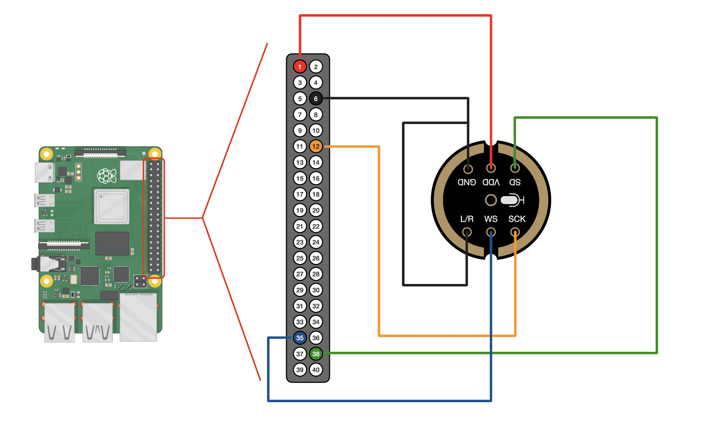
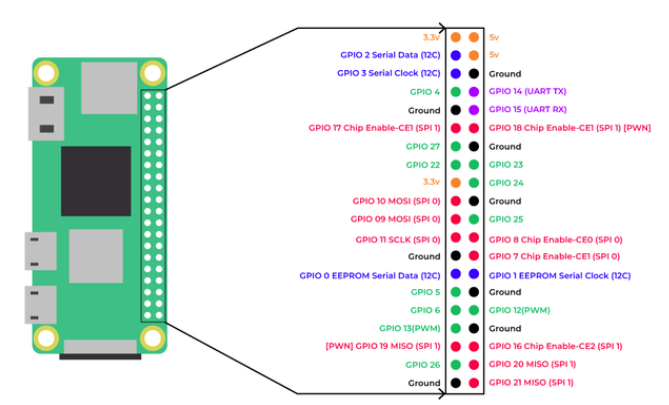

# SmartFrame

Raspberry Pi Zero 2 powered smart display with two modes: a Magic Mirror (Chromium kiosk via MagicMirror²) and a real-time audio spectrum analyzer & decibel meter (pygame + PyAudio). Modes are switched remotely via MQTT, with native Home Assistant integration.
Designed for a 14" matte LCD to mimic an e-ink aesthetic.

## Hardware

- **Raspberry Pi**: Zero 2 WH or newer.
- **Screen**: 13.3" or 14" IPS Matte LCD (1920x1080) with HDMI controller board.
- **Audio**: INMP441 Microphone (I2S) for digital audio capture.

## Microphone Wiring (Pi Zero 2 WH <-> INMP441)

To connect the INMP441 I2S microphone to your Raspberry Pi, follow the wiring table below or the visual diagram:

| INMP441 Pin | Raspberry Pi Pin (Physical) | GPIO Pin | Function             |
|:------------|:----------------------------|:---------|:---------------------|
| **VDD**     | Pin 1 (3.3V)                | -        | Power                |
| **GND**     | Pin 6 (GND)                 | -        | Ground               |
| **L/R**     | Pin 9 (GND)                 | -        | Channel Selec (Left) |
| **SCK**     | Pin 12                      | GPIO 18  | Serial Clock         |
| **WS**      | Pin 35                      | GPIO 19  | Word Select          |
| **SD**      | Pin 38                      | GPIO 20  | Serial Data          |





## Screenshots


## Linux Prerequisites (Raspberry Pi OS)

1. **Enable I2S Microphone**: Update `/boot/firmware/config.txt`:

   ```ini
   dtparam=i2s=on
   dtoverlay=googlevoicehat-soundcard
   ```

2. **Enable GPU Acceleration**: Ensure the KMS overlay is active in `/boot/firmware/config.txt`:

   ```ini
   dtoverlay=vc4-kms-v3d
   gpu_mem=128
   ```

3. **Configure Screen**: Adapt to your needs:

```ini
# Forces HDMI and resolution 1080p 60Hz
hdmi_force_hotplug=1
hdmi_group=2
hdmi_mode=82
```

or force the kernel by adding into `/boot/firmware/cmdline.txt`:

   ```ini
   video=HDMI-A-1:1920x1080M@60
   ```

4. **Power Management Tools**: To ensure the screen shuts off immediately (avoiding the "No Signal" delay), install CEC and DDC utilities:

   ```bash
   sudo apt update
   sudo apt install -y cec-utils ddcutil
   ```

*(A reboot is required after applying these changes).*

## Performance Optimization (Pi Zero 2 WH)

The Pi Zero 2 WH has limited RAM (512MB). To prevent Chromium from crashing and maintain a "snappy" UI, it is highly recommended to increase the swap size to 1.5GB using native Linux tools:

```bash
# 1. Disable a-la-carte swap scripts (if any)
sudo apt remove -y rpi-swap dphys-swapfile systemd-zram-generator

# 2. Create a permanent 1.5GB swap file
sudo swapoff -a
sudo fallocate -l 1.5G /swapfile
sudo chmod 600 /swapfile
sudo mkswap /swapfile
sudo swapon /swapfile

# 3. Make it permanent on boot:
# Open /etc/fstab and add this line at the bottom:
/swapfile none swap sw 0 0
```

SmartFrame automatically detects the GPU state and will enable hardware-accelerated 2D canvas and GLES2 rendering if available.

## SmartFrame Installation

```bash
git clone https://github.com/Perhan35/smart-frame.git
cd smart-frame
./scripts/setup_pi.sh
```

On some systems (Raspberry Pi Zero 2) the RAM is too low for pip to install the dependencies. In that case, you should create a temporary directory:

```bash
mkdir -p ~/pip_tmp
TMPDIR=~/pip_tmp ./scripts/setup_pi.sh
```

The setup script installs all OS-level dependencies (`portaudio`, SDL2, Chromium, etc.), creates a Python virtual environment (`.venv/`), and installs the Python packages inside it.

## Configuration

The setup script creates `config.yaml` from `config.example.yaml` automatically. Edit `config.yaml` to set your preferences (it is gitignored):

- **MQTT**: Set up your broker IP, port, and credentials.
- **MagicMirror**: Set the URL corresponding to your local MagicMirror instance.
- **Audio Mode**:
  - `device_index`: Specific ALSA microphone index ID (if required).
  - `threshold_db_warning`: Volume (in dB) where the dB text will turn yellow/orange (default: 60).
  - `threshold_db_error`: Volume (in dB) where the dB text will turn red (default: 85).

> **Note:** The setup script will warn you if `config.yaml` still has placeholder values and skip the service installation prompt until you configure it.

## Usage

Manual startup:

```bash
source .venv/bin/activate
python3 main.py
```

### Service Installation / Update (Start on Boot)

To install or update the service, run the install script:

```bash
./scripts/install_service.sh
```

This generates the systemd service file from the template (`scripts/smartframe.service`), and installs/starts it.

## Universal Display Control (DDC/CI & CEC)

SmartFrame features high-performance hardware display management, allowing it to bypass the slow "No Signal" standby delay and control the monitor's internal settings directly via DDC/CI.

### Core Features

- **Instant Power**: Uses `ddcutil`/`cec-client` to put the monitor into true standby instantly.
- **Hardware Brightness & Contrast**: Direct 0-100% control of the backlighting and contrast ratio.
- **Color Temperature Profiles**: Switch between **Warm (5000K)**, **Natural (6500K)**, and **Cool (9300K)** via MQTT.
- **Input Source Switching**: Electronically switch the monitor between the **Pi (HDMI-1)**, a secondary device (**HDMI-2**), or **DisplayPort**.
- **Settings Persistence**: All display settings are cached and automatically restored when the screen powers on.

### Required Tools

Install the utilities to enable hardware-level control:

```bash
sudo apt update
sudo apt install -y cec-utils ddcutil
```

*Note: The setup script automatically handles group permissions (`i2c`) for these tools.*

## Performance & Persistent Caching

To ensure maximum responsiveness on the Pi Zero 2 WH, SmartFrame uses an advanced multi-layer caching system:

1. **Hardware Discovery Cache**: Remembers which power command (DDC or CEC) and which HDMI port (`HDMI-1`) works for your setup, skipping slow scans on boot.
2. **Persistent Browser Profiles**: Both **Chromium** and **Cog** use persistent data directories (`.chromium_profile/` and `.cog_profile/`). This ensures that MagicMirror assets are cached locally and don't need to be redownloaded, significantly speeding up Mirror Mode transitions.
3. **Binary Path Caching**: Remembers the exact location of tool binaries to eliminate redundant `which` shell calls.

## Home Assistant Integration

SmartFrame natively supports **Home Assistant MQTT Auto-Discovery**. Once connected, it automatically creates a "Smart Frame" device with the following entities:

| Entity Name | Type | Function |
| :--- | :--- | :--- |
| **SmartFrame Mode** | `select` | Switch between `off`, `mirror`, `audio`, etc. |
| **SmartFrame Brightness** | `number` | Direct hardware backlight control (0-100%). |
| **SmartFrame Contrast** | `number` | Direct hardware contrast control (0-100%). |
| **SmartFrame Color Profile** | `select` | Switch between sRGB, Warm, Natural, and Cool. |
| **SmartFrame Input** | `select` | Switch monitor input source (HDMI-1, HDMI-2, etc.). |

### Advanced MQTT Topics

The orchestrator uses the following topics for integration with other systems (e.g., Node-RED):

- `smartframe/set_mode` / `smartframe/mode_state`
- `smartframe/set_brightness` / `smartframe/brightness_state`
- `smartframe/set_contrast` / `smartframe/contrast_state`
- `smartframe/set_color_preset` / `smartframe/color_preset_state`
- `smartframe/set_input_source` / `smartframe/input_source_state`
- `smartframe/status` (LWT: `online`/`offline`)
- `smartframe/modes_available` (JSON list of modes)

